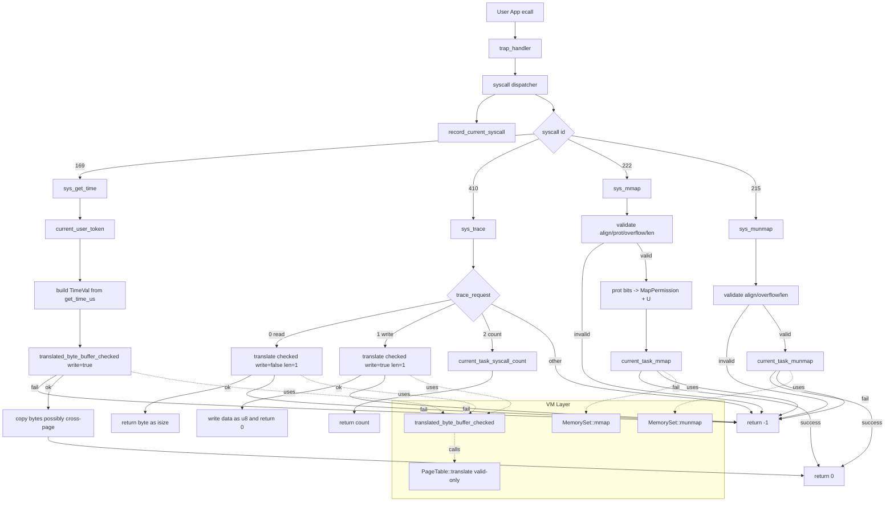

# lab2 详细实验说明：`sys_get_time` / `sys_trace` / `mmap` / `munmap`

## 1. 实验背景与问题重述
在 ch4 引入虚拟内存后，内核不能再像 ch3 一样直接把用户给的地址当成“可直接解引用的物理地址”使用。

如果继续沿用旧写法，会出现两类问题：
- 功能错误：用户地址可能并不在当前地址空间可达位置，直接读写会失败。
- 安全错误：即使地址可达，也可能缺少读/写权限，直接访问会破坏隔离。

本实验目标是：
- 重写 `sys_get_time` 与 `sys_trace`，让它们基于“当前任务页表 + 权限检查”工作。
- 实现匿名 `mmap/munmap`，提供用户态按页申请/释放映射能力。

## 2. 总体逻辑框架
本次实现分成四层：

1. 地址翻译层（`mm/page_table.rs`）
- 提供“带权限检查的用户缓冲区翻译”。

2. 地址空间管理层（`mm/memory_set.rs`）
- 提供当前进程地址空间级别的 `mmap/munmap` 基础操作。

3. 任务管理层（`task/task.rs` + `task/mod.rs`）
- 保存每任务 syscall 计数。
- 提供“当前任务执行 mmap/munmap”和“读取 syscall 计数”的封装。

4. syscall 业务层（`syscall/mod.rs` + `syscall/process.rs`）
- 统一入口记账。
- 实现 `sys_get_time/sys_trace/sys_mmap/sys_munmap` 的参数检查和业务逻辑。

这样做的原因是“分层职责清晰”：
- syscall 层只负责参数语义和错误码。
- 页表/地址空间层负责“地址是否有效、权限是否允许、映射是否存在”。

## 3. 代码修改总览（按文件）

### 3.1 `os/src/mm/page_table.rs`
新增：`translated_byte_buffer_checked(token, ptr, len, write) -> Option<Vec<&mut [u8]>>`

核心步骤：
- `len == 0` 时返回空切片列表（合法空操作）。
- 用 `checked_add` 防止 `ptr + len` 溢出。
- 按页遍历 `[ptr, ptr+len)`：
  - 查 PTE：不存在返回 `None`。
  - 检查 `PTE_U`：不是用户页返回 `None`。
  - 根据 `write` 检查 `PTE_W` 或 `PTE_R`：不满足返回 `None`。
  - 把跨页区间拆成多个切片返回。

同时修复 `translate(vpn)`：
- 旧行为：即使 PTE 无效也可能返回 `Some`（含空 PTE）。
- 新行为：只有 `pte.is_valid()` 才返回 `Some`。
- 作用：避免 `munmap` 后被误判“仍已映射”。

### 3.2 `os/src/mm/mod.rs`
导出新函数：`translated_byte_buffer_checked`。

### 3.3 `os/src/mm/memory_set.rs`
新增：
- `mmap(start, end, permission) -> bool`
- `munmap(start, end) -> bool`

`mmap` 逻辑：
- 先检查目标 VPN 区间是否全未映射。
- 若有任意已映射页，返回 `false`。
- 否则创建 `MapArea::Framed` 并 push 进地址空间。

`munmap` 逻辑：
- 先检查目标 VPN 区间是否全已映射。
- 再要求“存在一个精确匹配 `[start,end)` 的 Framed 区域”。
- 找到后从 `areas` 移除并执行 `unmap`。

说明：这里采用“精确区间匹配”的策略，能够满足本实验测试用例和简化实现。

### 3.4 `os/src/task/task.rs`
新增：
- 常量 `MAX_SYSCALL_NUM = 512`
- `TaskControlBlock` 字段 `syscall_times: [usize; MAX_SYSCALL_NUM]`

初始化时将数组置零，表示每个任务的 syscall 计数从 0 开始。

### 3.5 `os/src/task/mod.rs`
新增当前任务相关封装：
- `record_current_syscall(syscall_id)`
- `current_task_syscall_count(syscall_id)`
- `current_task_mmap(start, len, perm)`
- `current_task_munmap(start, len)`

这样 syscall 层无需直接操作 `TaskManager.inner`，降低耦合。

### 3.6 `os/src/syscall/mod.rs`
在总入口 `syscall(...)` 开始处加入：

```rust
record_current_syscall(syscall_id);
```

原因：
- 保证所有 syscall 自动记账，不会漏统计。
- `sys_trace(trace_request=2)` 查询时，本次 `sys_trace` 本身已计入。

### 3.7 `os/src/syscall/process.rs`
完整实现四个函数：
- `sys_get_time`
- `sys_trace`
- `sys_mmap`
- `sys_munmap`

下节分函数详细解释。

## 4. 逐函数详细解释（每一步做什么、为什么这样做）

### 4.1 `sys_get_time(ts, tz)`
目标：把当前时间写到用户给的 `TimeVal*`。

步骤：
1. `token = current_user_token()`
- 获取当前任务页表 token，后续翻译都基于它。

2. 读取硬件时间并构造内核侧 `time_val`
- `us = get_time_us()`
- `TimeVal { sec: us / 1_000_000, usec: us % 1_000_000 }`

3. 把 `time_val` 视为字节数组 `src`
- 用 `from_raw_parts` 得到固定长度（`size_of::<TimeVal>()`）字节切片。

4. 调用 `translated_byte_buffer_checked(token, ts, len, write=true)`
- 如果用户地址不可写/不可见/跨页中有非法页，返回 `-1`。

5. 分段拷贝到用户缓冲区
- 因为可能跨页，目的地址是多个切片。
- 逐片 `copy_from_slice` 完成写回。

6. 成功返回 `0`。

关键点：
- 这正是注释里“`TimeVal` 可能跨页”的处理方式。

### 4.2 `sys_trace(trace_request, id, data)`
目标：实现读/写/计数三种模式。

#### 分支 A：`trace_request == 0`（读 1 字节）
1. 用 `translated_byte_buffer_checked(..., len=1, write=false)` 翻译地址。
2. 若失败返回 `-1`。
3. 成功读取 `buf[0][0]`，以 `isize` 返回。

#### 分支 B：`trace_request == 1`（写 1 字节）
1. 用 `translated_byte_buffer_checked(..., len=1, write=true)` 翻译地址。
2. 若失败返回 `-1`。
3. 成功写入 `data as u8`，返回 `0`。

#### 分支 C：`trace_request == 2`（查询 syscall 次数）
1. 调用 `current_task_syscall_count(id)`。
2. 返回计数。

#### 分支 D：其他请求
返回 `-1`。

关键点：
- 对读写地址严格执行“页存在 + 用户位 + 对应读写权限”检查，符合 ch4 要求。

### 4.3 `sys_mmap(start, len, prot)`
目标：把 `[start, start+len)` 映射为用户页，权限由 `prot` 指定。

参数检查顺序：
1. `start` 必须页对齐：`start % PAGE_SIZE == 0`。
2. `prot` 只能使用低 3 位：`prot & !0x7 == 0`。
3. `prot` 不能全 0：`prot & 0x7 != 0`。
4. `start + len` 必须不溢出：`checked_add`。
5. `len == 0` 直接返回 `0`（空映射视为成功空操作）。

权限转换：
- 始终加 `MapPermission::U`（用户态可见）。
- `prot bit0 -> R`，`bit1 -> W`，`bit2 -> X`。

执行映射：
- 调用 `current_task_mmap(start, len, map_perm)`。
- 成功返回 `0`，失败返回 `-1`（冲突、无帧等都归并为失败）。

### 4.4 `sys_munmap(start, len)`
目标：取消 `[start, start+len)` 映射。

参数检查：
1. `start` 页对齐。
2. `start + len` 不溢出。
3. `len == 0` 返回 `0`。

执行：
- 调用 `current_task_munmap(start, len)`。
- 成功 `0`，失败 `-1`。

## 5. 边界条件与错误码设计

### 5.1 `sys_trace` 读写
- 地址不在用户映射内：`-1`
- 地址在用户映射内但权限不足：`-1`
- 地址跨页且其中一页不合法：`-1`

### 5.2 `sys_mmap`
- 未页对齐：`-1`
- `prot` 非法：`-1`
- 地址溢出：`-1`
- 区间已有映射页：`-1`
- 成功：`0`

### 5.3 `sys_munmap`
- 未页对齐或溢出：`-1`
- 区间含未映射页：`-1`
- 成功：`0`

## 6. 为什么一定要加 `PTE_U`
在 RISC-V 下，用户态访问页表项不仅要看 `R/W/X`，还需要 `U` 位允许用户态访问。

若只设置 `R/W/X` 不设置 `U`：
- 用户程序访问该页仍会触发异常。
- `trace` 的“用户地址可读可写”语义也会被破坏。

因此本实验在权限映射里统一加入 `MapPermission::U`，并在翻译检查时显式校验 `PTE_U`。

## 7. 测试过程与结果

### 7.1 本地 chapter 测试
命令：

```bash
cd os
make run CHAPTER=4 TEST=4 BASE=0
```

关键通过输出：
- `Test 04_1 OK!`
- `Test 04_4 test OK!`
- `Test 04_5 ummap OK!`
- `Test 04_6 ummap2 OK!`
- `Test trace_1 OK!`

### 7.2 checker 测试
命令：

```bash
cd ci-user
make test CHAPTER=4
```

结果：
- 功能检查 `16/16` 通过。
- 报告检查通过（`lab1`、`lab2` 均检测到）。

## 8. 完整逻辑示意图



## 9. 小结
本实验的核心不是“把 syscall 写出来”，而是把“虚存+权限”纳入 syscall 的正确性定义：
- 所有用户指针都必须经过页表翻译与权限校验。
- 所有地址空间操作都必须在当前任务 `MemorySet` 内完成。
- syscall 统计应放在统一入口，避免遗漏。

这样实现后，`sys_get_time/sys_trace/mmap/munmap` 在虚存语义下恢复了正确行为，并通过 ch4 全部测例。
